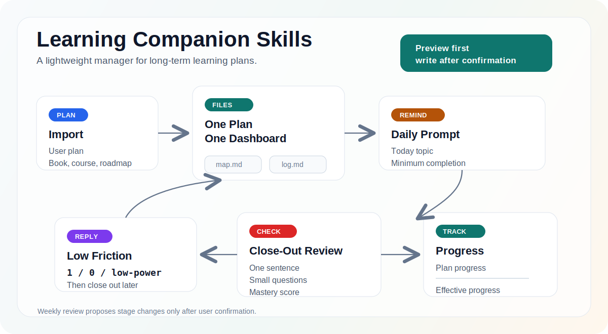

# Learning Companion Skills

AI skills for long-term learning plans, reminders, dashboards, and progress tracking.

[中文说明](README.zh.md)



This project helps AI agents act as a lightweight learning companion for any subject: technology, literature, philosophy, language learning, professional skills, and more.

The core idea is simple:

> A learning plan should not disappear into scattered chat sessions.

The skills in this repository help convert a user-provided learning plan into a trackable map, keep one dashboard per plan, remind the learner with today's actual learning content, and record progress after a lightweight review.

## MVP Skill

```text
skills/
  learning-companion/
```

### `learning-companion`

Use this skill to manage one or more long-term learning plans.

It supports:

- one dashboard per learning plan
- plan import preview before writing files
- daily reminders with the current learning topic
- lightweight tutor mode for prompts like `teach me`, `continue learning`, `I don't understand`, `give me another example`, or `teacher mode`
- `1 / 0 / low-power / 下课` interaction protocol
- lightweight review with one-sentence understanding and small verification questions
- plan progress and effective progress tracking
- daily rescue tasks and weekly review

It does not design a full curriculum from scratch by default. The user provides the learning plan; the skill normalizes, tracks, reminds, reviews, and adjusts pacing.

## Tutor Mode

`learning-companion` can now act as a lightweight teacher for the current learning item, not only as a tracker. When the learner asks to continue learning, asks for teaching, says they do not understand, or asks for another example, the skill reads the active dashboard and teaches the current topic in small steps.

Tutor mode follows a compact pattern:

1. explain the core idea in plain language
2. connect it to the learner's plan, project, or source material
3. give one concrete example
4. point out one common misconception or boundary
5. ask exactly one check question

Tutor mode does not advance effective progress by itself. The learner still finishes with `下课`, and the normal close-out review scores mastery and updates the dashboard and log.

## Data Model

Generated learning data belongs to the user's workspace, not this skill repository.

Recommended structure in the target workspace:

```text
learning-companion/
  index.md
  plans/
    <plan-id>/
      dashboard.md
      map.md
      log.md
```

## Install

After this repository is published, install with a skills-compatible CLI:

```bash
npx skills add huajiexiewenfeng/learning-companion-skills
```

For local development:

```bash
npx skills add .
```

Restart Codex or your agent runtime after installation so the skill can be rediscovered.

## Status

MVP draft. The current focus is one reliable general-purpose learning companion skill before adding more specialized extensions.
