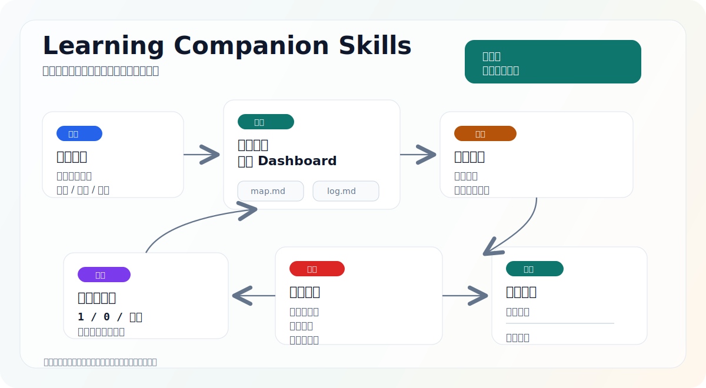

# Learning Companion Skills

一组用于长期学习计划管理的 AI Skills，支持提醒、Dashboard、进度追踪和轻量复盘。

[English README](README.md)



这个项目的目标，是让 AI Agent 成为一个通用型学习管家，适用于技术、文学、哲学、语言、职业技能等长期学习计划。

核心想法很简单：

> 学习计划不应该散落在一个个聊天 session 里。

这个仓库里的 skills 会把用户提供的学习计划转成可追踪的学习地图，为每个计划维护独立 dashboard，在提醒时带上当天学习内容，并在用户“下课”后做轻量验证和记录。

## MVP Skill

```text
skills/
  learning-companion/
```

### `learning-companion`

用于管理一个或多个长期学习计划。

它支持：

- 一个学习计划一个 dashboard
- 创建计划前先预览，不直接落盘
- 每日提醒时带当天学习内容
- 轻量老师模式，支持“你来教我学习”“继续学习”“我不明白”“换个例子”“老师模式”等触发方式
- `1 / 0 / 低配 / 下课` 低摩擦交互协议
- 一句话理解 + 小题验证
- 计划进度和有效进度同时追踪
- 日级补救和周复盘

它默认不从零设计课程。用户提供学习计划，skill 负责规范化、追踪、提醒、验证和节奏调整。

## 老师模式

`learning-companion` 现在不仅能追踪学习进度，也可以围绕当天学习项做轻量教学。当学习者要求继续学习、让 AI 来教、表示不明白，或要求换个例子时，skill 会读取当前 dashboard，并针对今天的主题小步讲解。

老师模式使用一个紧凑流程：

1. 用简单语言说明核心概念
2. 连接到学习者的计划、项目或原始材料
3. 给一个具体例子
4. 点出一个常见误区或边界
5. 只问一个检查问题

老师模式不会直接推进有效进度。学习者仍然通过 `下课` 收口，正常复盘会评分掌握度，并更新 dashboard 和 log。

## 数据模型

学习数据属于用户自己的 workspace，不属于这个 skill 仓库。

推荐在目标 workspace 中生成：

```text
learning-companion/
  index.md
  plans/
    <plan-id>/
      dashboard.md
      map.md
      log.md
```

## 安装

仓库发布后，可以用支持 skills 的 CLI 安装：

```bash
npx skills add huajiexiewenfeng/learning-companion-skills
```

本地开发时：

```bash
npx skills add .
```

安装后，重启 Codex 或你的 Agent 运行环境，让 skill 被重新发现。

## 状态

MVP 草稿阶段。当前重点是先把一个通用学习管家 skill 做稳，再扩展更多专业化能力。
