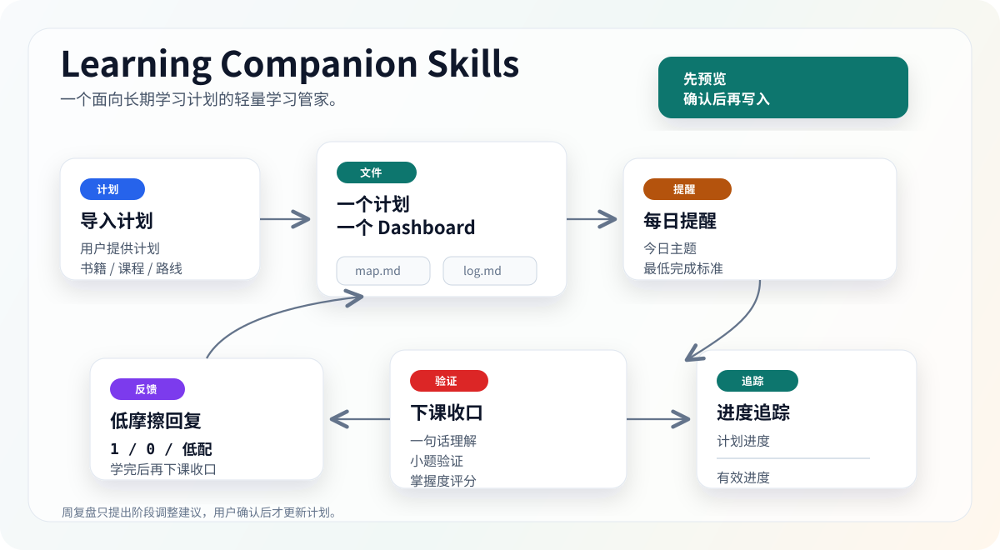
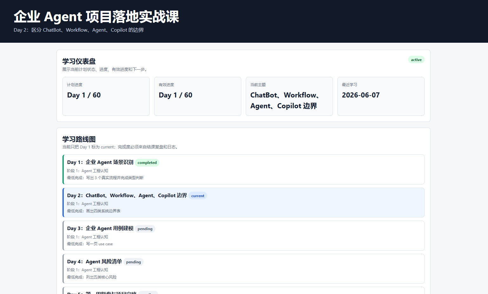
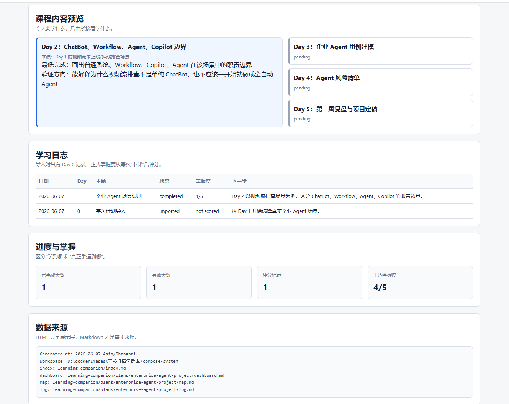

# Learning Companion Skills

一组用于长期学习计划管理的 AI Skills，支持提醒、Dashboard、进度追踪、轻量复盘和静态学习看板。

[English README](README.md)



## 效果预览

导入学习计划后，`learning-companion` 会默认生成一个本地静态学习看板：



看板会继续展示课程内容预览、学习日志、进度与掌握、数据来源等信息：



HTML 看板不是事实来源。事实来源仍然是本地 Markdown 文件；当用户回复 `1` 开始学习或回复 `下课` 完成复盘后，如果看板已经存在，skill 会自动刷新 `window.learningData` 数据块。

这个项目的目标，是让 AI Agent 支持长期自学，适用于技术、文学、哲学、语言、职业技能等学习计划。

核心想法很简单：

> 学习计划不应该散落在一个个聊天 session 里。

这个仓库里的 skills 支持一个两段式学习流程：

```text
course-designer
-> 把目标变成个人定制课程

learning-companion
-> 跟踪、教学、复盘和记录课程
```

## Skills

```text
skills/
  course-designer/
  learning-companion/
```

### `course-designer`

用于学习正式开始前。

它帮助用户把模糊学习意图变成一份个人定制课程包：确认 North Star，识别学习背景、时间和约束，设计阶段或 Sprint，定义可见产出和验收标准，并输出可交给 `learning-companion` 导入的课程预览。

典型请求：

- “我想学 AI，帮我设计课程。”
- “帮我确认 North Star。”
- “设计一个 90 天 / 150 天学习计划。”
- “把这个目标变成可以导入 learning-companion 的课程。”

### `learning-companion`

用于已有课程或学习计划之后。

它支持：

- 一个学习计划一个 dashboard
- 创建计划前先预览，不直接落盘
- 每日提醒时带当天学习内容
- 轻量老师模式，支持“你来教我学习”“继续学习”“我不明白”“换个例子”“老师模式”等触发方式
- `1 / 0 / 低配 / 下课` 低摩擦交互协议
- 一句话理解 + 小题验证
- 计划进度和有效进度同时追踪
- 低分复习任务和周复盘
- 导入计划后默认生成静态 HTML 学习看板，从 Markdown 学习文件生成

它默认不从零设计课程。用户提供学习计划，或导入 `course-designer` 设计好的课程；skill 负责规范化、追踪、提醒、验证和节奏调整。

## 推荐工作流

```text
1. 用 course-designer 确认 North Star。
2. 预览个人定制课程包。
3. 用户确认课程。
4. 用 learning-companion 导入课程。
5. 后续由 learning-companion 负责每日学习、老师模式、下课复盘、打分和进度追踪。
6. 导入完成后，learning-companion 默认生成 learning-console.html。
7. 后续回复 `1` 开始学习或 `下课` 完成复盘后，已存在的 learning-console.html 会自动刷新数据块。
```

## 静态学习看板

`learning-companion` 会在学习计划导入后，在学习者自己的 workspace 中默认生成一个独立的 `learning-console.html` 文件。它不是一个复杂系统，也不需要本地服务，只是一个静态展示页。

看板重点展示五个模块：

- 学习仪表盘
- 学习路线图
- 学习日志
- 课程内容预览
- 进度与掌握

典型请求：

- “导入这个计划到 learning-companion”
- “看下学习进度”
- “我的学习情况”
- “创建学习面板”
- “刷新学习面板”
- “看今天学什么”
- “看下掌握度”

HTML 不是事实来源。skill 会读取 Markdown 文件，生成 `window.learningData`，再刷新静态看板。自动刷新只更新数据块，不重写 HTML 布局、CSS 或渲染逻辑。

## 老师模式

`learning-companion` 不仅能追踪学习进度，也可以围绕当天学习项做轻量教学。当学习者要求继续学习、让 AI 来教、表示不明白，或要求换个例子时，skill 会读取当前 dashboard，并针对今天的主题小步讲解。

老师模式使用一个紧凑流程：

1. 用简单语言说明核心概念
2. 连接到学习者的计划、项目或原始材料
3. 给一个具体例子
4. 点出一个常见误区或边界
5. 只问一个检查问题

老师模式不会直接推进有效进度。学习者仍然通过 `下课` 收口，正常复盘会评分掌握度，并更新 dashboard 和 log。

## Voice 课程课件与会话存档

课件先于教学：无论是文字课还是明确的 Voice 请求，`learning-companion` 都会先写入可阅读的 Markdown 来源（`lesson.md`）和结构化 lesson model，渲染离线课件包，验证每个工件，再打开或链接课件 hub。Markdown 是可阅读的教学文本和来源记录，不是 HTML 的替代品。

以下产物必须区分：

- **原生 Voice** 是宿主中可观察到的新 Voice task 能力；已有文字 task 不会被悄悄切换成原生 Voice。
- **可阅读教学文本** 是会话目录中的 `lesson.md` 来源记录。
- **归档 HTML 课件** 是按会话保存的自包含 hub、卡片和可单独访问的 slide。
- **HTML deck** 是 `decks/` 下渲染出的浏览器课件，不是 PowerPoint 导出。
- **`.pptx`** 明确不在范围内；本仓库发布离线 HTML 课件，而不是演示文稿文件。

每次教学都会拥有自己的会话存档和 artifact ledger。提交到仓库的确定性 renderer 会把相同的 `lesson-model.json` 输入生成相同字节；未变化的 sync 会复用工件，不会创建 `v2`。因此，即使是能力较低的模型，也只能产出受约束的结构化 model，最终 HTML 始终由可信运行时稳定生成。

课件采用受 Technical Visual Companion 启发的门禁：离线自包含、响应式/深色/减少动效、关系图可访问性、精确来源证据、每个工件的确定性验证，以及独立的桌面与 390px 视觉复核。确定性验证不能替代视觉复核。

准备课件、开始文字教学或交接到原生 Voice 都不会推进 Effective progress；只有完成掌握度复盘后的正常 `下课` 收口才可能推进。

## 数据模型

学习数据属于用户自己的 workspace，不属于这个 skill 仓库。

推荐在目标 workspace 中生成：

```text
learning-companion/
  index.md
  learning-console.html              # 导入计划后默认生成的静态看板
  plans/
    <plan-id>/
      dashboard.md
      map.md
      log.md
```

## 示例

```text
examples/
  technical-learning/
    dashboard.md
    learning-console.html
    lessons/
      day-01-system-layers/           # 可读来源 + 渲染后的 HTML 存档
  philosophy-reading/
    dashboard.md
```

## 安装

仓库发布后，可以用支持 skills 的 CLI 安装：

```bash
npx skills add huajiexiewenfeng/learning-companion-skills
```

本地开发时：

```bash
npx skills add .
```

安装后，重启 Codex 或你的 Agent 运行环境，让 skill 被重新发现。

## 状态

早期草稿阶段。当前重点是先打通“个人定制课程设计 + 长期学习跟踪 + 静态学习看板”的轻量闭环。
